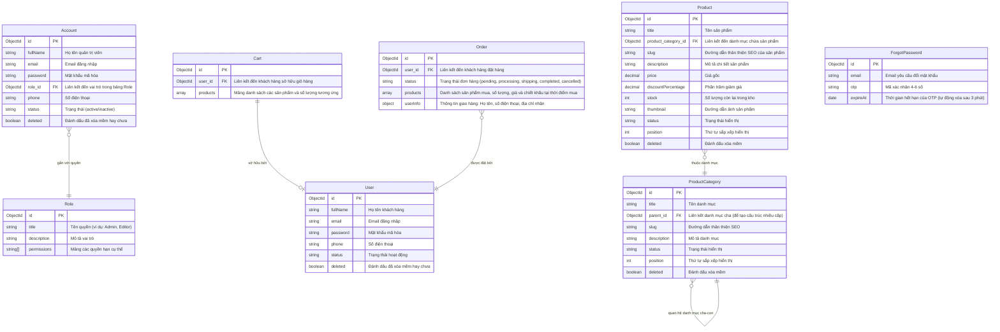

<h1 align="center">
  <a href="https://nuxt.com/" target="blank"></a>
  <a href="https://vuejs.org/" target="blank"></a>
  <a href="https://www.typescriptlang.org/" target="blank"></a>
  <a href="https://www.mongodb.com/" target="blank"></a>
  <a href="https://cloudinary.com/" target="blank"></a>
</h1>

<p align="center">Website bán hàng được xây dựng bằng <b>Nuxt 3</b> sử dụng TypeScript.</p>

<p align="center">
  
  
  
</p>

Đây là dự án website bán hàng (E-Commerce) hoàn chỉnh được xây dựng trên nền tảng **Nuxt 3** sử dụng ngôn ngữ **TypeScript**. Hệ thống bao gồm đầy đủ cả giao diện mua sắm dành cho khách hàng lẫn trang quản trị (Admin Dashboard) dành cho người quản lý. Dữ liệu của trang web được lưu trữ và đồng bộ thông qua cơ sở dữ liệu **MongoDB**, ảnh sản phẩm được tải trực tiếp lên dịch vụ đám mây **Cloudinary**, và hệ thống gửi mã OTP xác nhận tài khoản qua email thông qua **Nodemailer**.

---

## Giao diện trang quản trị

https://github.com/user-attachments/assets/f1a28b9e-0b26-4eed-9892-c5f229df9023

---

## Giao diện khách hàng

https://github.com/user-attachments/assets/554ebff2-0e78-4b56-b3a6-c5e5e9245e93

---

## Các tính năng nổi bật của dự án

Hệ thống được phát triển với nhiều tính năng thực tế của một trang thương mại điện tử chuyên nghiệp:

* **Trải nghiệm mượt mà**: Nhờ sức mạnh của Nuxt 3 và Vue 3, các trang web được chuyển hướng cực kỳ nhanh chóng mà không cần tải lại toàn bộ trang (Single Page Application). Ngoài ra trang web còn hỗ trợ giao diện tối (Dark Mode) thời thượng, giúp bảo vệ mắt khi sử dụng vào ban đêm.
* **Tự động gộp giỏ hàng**: Khi khách chưa đăng nhập tài khoản (khách vãng lai), họ vẫn có thể thêm sản phẩm vào giỏ hàng tạm thời. Ngay sau khi họ đăng nhập thành công, hệ thống sẽ tự động gộp tất cả sản phẩm từ giỏ hàng tạm này vào giỏ hàng chính trong tài khoản cá nhân của họ.
* **Quy trình đặt hàng thông minh & Tránh lệch kho**: Để đảm bảo tính chính xác, hệ thống luôn kiểm tra số lượng tồn kho thực tế trong database ngay tại thời điểm khách hàng bấm đặt hàng. Nếu sản phẩm đã hết hoặc không đủ số lượng, hệ thống sẽ ngăn chặn việc tạo đơn. 
* **Tự động hoàn kho khi hủy đơn**: Nếu khách hàng hoặc quản trị viên hủy đơn hàng, hệ thống sẽ tự động cộng ngược lại số lượng sản phẩm của đơn hàng đó vào kho để người khác có thể mua.
* **Quản lý danh mục sản phẩm nhiều cấp**: Hỗ trợ tạo danh mục theo cấu trúc hình cây (cha - con) không giới hạn cấp độ. Hệ thống có cơ chế bảo vệ: bạn không được phép xóa một danh mục nếu trong danh mục đó hoặc các danh mục con của nó vẫn còn chứa sản phẩm đang bán.
* **Thùng rác thông minh (Xóa mềm)**: Khi bạn xóa sản phẩm hay danh mục, chúng không bị mất vĩnh viễn ngay lập tức mà được đưa vào "Thùng rác". Quản trị viên có thể xem danh sách thùng rác này và chọn khôi phục lại dữ liệu bất kỳ lúc nào hoặc xóa hẳn nếu muốn.
* **Tải ảnh trực tiếp lên đám mây Cloudinary**: Trong trang thêm/sửa sản phẩm của Admin, bạn có thể tải ảnh trực tiếp từ máy tính lên. Hệ thống sẽ tự động upload ảnh lên tài khoản Cloudinary của bạn và lưu đường dẫn ảnh trả về vào database.
* **Mã hóa và bảo mật bằng JWT**: Mọi tài khoản đều được mã hóa mật khẩu an toàn trước khi lưu vào database. Khi đăng nhập, hệ thống cấp mã Token JWT để nhận diện và phân quyền truy cập cho người dùng.
* **Khôi phục mật khẩu bằng OTP**: Khi khách hàng quên mật khẩu, hệ thống sẽ tạo một mã OTP ngẫu nhiên gửi trực tiếp vào email đăng ký của khách hàng thông qua giao thức SMTP. Mã OTP này có thời hạn sử dụng trong vòng 3 phút để đảm bảo an toàn.
* **Khởi tạo dữ liệu mẫu cực nhanh (Seed Data)**: Hỗ trợ một đường dẫn API đặc biệt để tự động tạo trước danh sách tài khoản quản trị mẫu, các danh mục và hàng chục sản phẩm mẫu kèm hình ảnh, giúp bạn nhanh chóng có dữ liệu để test tính năng mà không cần tự nhập tay từ đầu.

---

## Công nghệ sử dụng trong dự án

### Phía Server (Backend)
* **Framework**: Nuxt 3 Server Routes (hoạt động trên nền Nitro v3 & h3).
* **Kết nối Database**: Mongoose 8.x (ODM chuyên dụng cho MongoDB).
* **Mã hóa mật khẩu**: Bcryptjs 2.x (Pure JavaScript giúp chạy ổn định trên mọi môi trường mà không cần cài thêm công cụ biên dịch C++ native).
* **Tạo và xác thực Token**: JsonWebToken 9.x.
* **Gửi Email SMTP**: Nodemailer 6.x.
* **Kiểm tra dữ liệu đầu vào (Validation)**: Zod 3.x (Giúp tự động kiểm tra định dạng email, mật khẩu, dữ liệu gửi lên từ client).

### Phía Giao diện (Frontend)
* **Framework chính**: Nuxt 3 (Vue 3 Composition API).
* **Quản lý trạng thái (State Management)**: Pinia 2.x.
* **Thiết kế giao diện**: CSS thuần (Vanilla CSS) viết tỉ mỉ, hỗ trợ Responsive trên cả điện thoại, máy tính bảng và màn hình máy tính.

---

## Hướng dẫn cài đặt và chạy thử dự án dưới Local

### Yêu cầu chuẩn bị trước
1. Máy tính của bạn đã cài đặt **Node.js** (Khuyến nghị phiên bản LTS mới nhất từ bản 20 trở lên).
2. Một database **MongoDB** (Bạn có thể cài đặt MongoDB Community Server chạy dưới local hoặc đăng ký một cụm MongoDB Atlas trên đám mây hoàn toàn miễn phí).
3. Một tài khoản **Cloudinary** (Đăng ký miễn phí để lấy các thông số API Key phục vụ upload ảnh).
4. Một tài khoản Gmail đã kích hoạt tính năng **Mật khẩu ứng dụng (App Password)** để làm tài khoản gửi OTP.

### Các bước cài đặt chi tiết

**Bước 1: Tải mã nguồn về máy tính**
Mở terminal hoặc command prompt trên máy của bạn và chạy lệnh sau để clone project:
```bash
git clone https://github.com/phamhoangvu2k7/Ecommerce.git
cd Ecommerce
```

**Bước 2: Cài đặt các thư viện cần thiết**
Chạy lệnh install để tải các thư viện trong file `package.json` về thư mục `node_modules`:
```bash
npm install --legacy-peer-deps
```

**Bước 3: Tạo và cấu hình file môi trường `.env`**
Tạo một file mới hoàn toàn có tên là `.env` nằm ở thư mục gốc của dự án (cùng cấp với file `nuxt.config.ts`). Sao chép nội dung dưới đây và thay thế bằng các thông tin kết nối thực tế của bạn:

```env
PORT=3000

# Đường dẫn kết nối đến cơ sở dữ liệu MongoDB của bạn
MONGO_URL=mongodb+srv://<username>:<password>@cluster.xxxx.mongodb.net/
MONGO_NAME=product-management

# Cấu hình tài khoản email dùng để gửi OTP cho khách hàng
EMAIL_USER=email_cua_ban@gmail.com
EMAIL_PASSWORD=mat_khau_ung_dung_gmail_gồm_16_ký_tự

# Các thông số API kết nối với tài khoản Cloudinary của bạn
CLOUD_NAME=ten_tai_khoan_cloudinary
CLOUD_KEY=ma_api_key_cloudinary
CLOUD_SECRET=ma_api_secret_cloudinary

# Khóa bí mật dùng để mã hóa session và JWT (Bạn điền chữ gì cũng được, nên dùng chữ dài và phức tạp)
SESSION_SECRET=chuoi_ky_tu_bi_mat_ngau_nhien_de_ma_hoa
JWT_SECRET=chuoi_ky_tu_bi_mat_ngau_nhien_dung_cho_token_jwt
```

**Bước 4: Chạy dự án ở chế độ phát triển (Development)**
Chạy lệnh sau để khởi động dự án ở máy của bạn:
```bash
npm run dev
```
Sau khi chạy lệnh, Nuxt sẽ tiến hành biên dịch code. Khi xuất hiện thông báo chạy thành công, bạn mở trình duyệt web và truy cập địa chỉ: [http://localhost:3000](http://localhost:3000)

**Bước 5: Khởi tạo dữ liệu mẫu (Seed Data)**
Khi mới chạy lần đầu, cơ sở dữ liệu của bạn sẽ trống trơn. Để tạo nhanh dữ liệu chạy thử, bạn hãy mở trình duyệt và truy cập vào đường link sau:
```text
http://localhost:3000/api/seed
```
Đợi khoảng vài giây, trình duyệt hiển thị thông báo tạo thành công. Lúc này database của bạn đã có sẵn các sản phẩm, danh mục và tài khoản quản trị để test tính năng.

---

## Cấu trúc thư mục của dự án

Cấu trúc thư mục của dự án Nuxt 3 được tổ chức khoa học để quản lý cả frontend lẫn backend trong cùng một nơi:

```text
├── server/                 # Thư mục chứa toàn bộ logic Backend
│   ├── api/                # Nơi định nghĩa các API routes của ứng dụng
│   │   ├── admin/          # Các API quản lý (Sản phẩm, danh mục, phân quyền, thùng rác,...)
│   │   ├── client/         # Các API dành cho khách hàng (Đăng nhập, đăng ký, giỏ hàng, đặt hàng,...)
│   │   └── seed.get.ts     # API tự động tạo dữ liệu mẫu cho database
│   ├── middleware/         # Middleware lọc và kiểm tra Token JWT của API Backend
│   ├── plugins/            # Các plugin chạy khi khởi động server (Kết nối database MongoDB)
│   └── utils/              # Chứa các hàm tiện ích (mã hóa mật khẩu, upload ảnh, models Mongoose...)
│
├── layouts/                # Chứa các khung giao diện chung (Layout Admin, Layout Default)
├── pages/                  # Chứa toàn bộ các trang giao diện của website (Trang chủ, chi tiết, giỏ hàng, dashboard admin,...)
├── components/             # Các thành phần giao diện nhỏ tái sử dụng nhiều lần (ProductCard, CartItem,...)
├── stores/                 # Nơi quản lý State (Trạng thái đăng nhập, giỏ hàng tạm thời) bằng thư viện Pinia
├── middleware/             # Middleware kiểm tra và chặn quyền chuyển trang ở phía Frontend
├── assets/                 # Nơi lưu trữ các file CSS dùng chung của hệ thống
├── app.vue                 # File root giao diện chính, nơi Nuxt mount toàn bộ layout và các page
├── nuxt.config.ts          # File cấu hình cấu trúc, thư viện và biến đầu trang của dự án Nuxt 3
└── package.json            # Nơi khai báo các thư viện sử dụng và tập lệnh chạy dự án
```

---

## Sơ đồ cấu trúc Cơ sở dữ liệu (Database Schema)

Dưới đây là sơ đồ chi tiết các bảng dữ liệu trong MongoDB và mối quan hệ giữa chúng trong hệ thống:



---

## Phân quyền chi tiết trong hệ thống

Hệ thống phân quyền truy cập chặt chẽ thông qua Token JWT và Middleware bảo mật ở cả hai phía Client lẫn Server:

1. **Khách hàng (Client)**:
   * Có quyền duyệt xem sản phẩm, tìm kiếm, lọc danh mục sản phẩm.
   * Thêm sản phẩm vào giỏ hàng cá nhân, tiến hành điền thông tin đặt hàng.
   * Xem và quản lý thông tin tài khoản cá nhân, xem danh sách lịch sử đơn hàng đã đặt và có quyền gửi yêu cầu hủy đơn hàng.

2. **Editor (Biên tập viên quản trị)**:
   * Có quyền đăng nhập vào hệ thống trang quản trị Admin Dashboard.
   * Được quyền xem danh sách sản phẩm, danh mục, đơn hàng của hệ thống.
   * Được quyền thêm sản phẩm mới, cập nhật chỉnh sửa thông tin sản phẩm và danh mục sản phẩm.
   * *Hạn chế*: Không có quyền xóa sản phẩm/danh mục (chỉ admin mới được xóa), không được quản lý các tài khoản quản trị khác và không được thay đổi cấu hình phân quyền hệ thống.

3. **Admin (Quản trị viên tối cao)**:
   * Có toàn bộ mọi quyền hạn của Editor.
   * Có quyền xóa sản phẩm, danh mục sản phẩm (đưa vào thùng rác) và dọn sạch thùng rác (xóa vĩnh viễn).
   * Quản lý danh sách tài khoản Admin & Editor khác (Tạo mới, sửa thông tin, khóa tài khoản).
   * Tạo mới các vai trò quản trị (Role) và phân chia chi tiết các quyền hạn tương ứng cho từng vai trò đó.

---

<p align="center">Dự án được hoàn thiện bởi <b>Phạm Hoàng Vũ</b></p>
