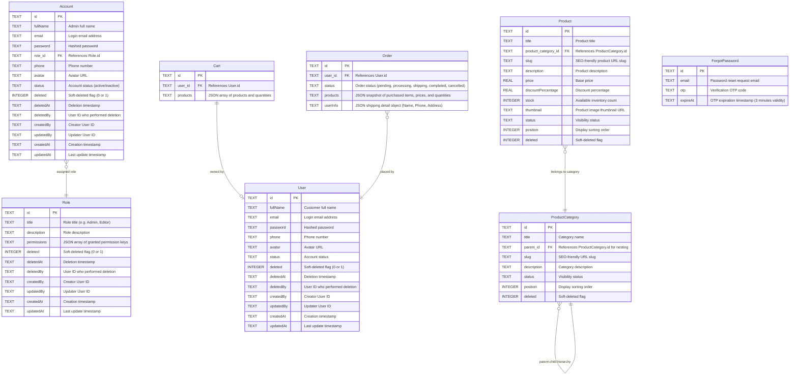

<h1 align="center">
  <a href="https://nuxt.com/" target="blank"></a>
  <a href="https://vuejs.org/" target="blank"></a>
  <a href="https://www.typescriptlang.org/" target="blank"></a>
  <a href="https://www.sqlite.org/" target="blank"></a>
  <a href="https://www.cloudflare.com/" target="blank"></a>
</h1>

<p align="center">E-Commerce platform built with <b>Nuxt 3</b> & <b>Nuxt Hub</b> powered by TypeScript.</p>

<p align="center">
  
  
  
</p>

A full-featured E-Commerce application built on top of **Nuxt 3** and **Nuxt Hub** using **TypeScript**. The system features a customer-facing store interface as well as an intuitive Admin Dashboard for catalog and store management. Data is stored in **SQLite (Cloudflare D1)**, product media assets are managed via **Nuxt Hub Blob (Cloudflare R2)**, and account recovery OTP emails are dispatched via the **Resend API** (or logged to the console in development mode).

---

## Admin Dashboard Preview

https://github.com/user-attachments/assets/f1a28b9e-0b26-4eed-9892-c5f229df9023

---

## Storefront (Client) Preview

https://github.com/user-attachments/assets/554ebff2-0e78-4b56-b3a6-c5e5e9245e93

---

## Key Features

* **Responsive & Dark Mode UI**: Full cross-device compatibility (Desktop, Tablet, Mobile) with real-time Light/Dark mode toggling.
* **Cart Synchronization**: Allows guest users to add items to a temporary cart, which seamlessly merges with their personal account cart upon logging in.
* **Inventory Stock Verification**: Validates real-time database stock counts prior to order placement to prevent overselling.
* **Automatic Stock Restoration**: Automatically restores product inventory counts whenever an order is cancelled.
* **Hierarchical Category Management**: Supports multi-level parent-child categories. Deletion is safely blocked if a category or its subcategories contain active products.
* **Soft Delete Trash System**: Product and category deletions use soft deletion, enabling administrators to easily restore or permanently purge archived items.
* **JWT Authentication & Security**: Passwords encrypted with `bcrypt-edge`. Role-based authorization and session management secured via JSON Web Tokens.
* **Email OTP Verification**: Delivers 3-minute temporary OTP codes via Resend API (or console log in dev) for password reset workflows.

---

## Tech Stack

### Backend (Server)
* **Framework**: Nuxt 3 Server Routes (Nitro v3 & h3 engine) integrated with **Nuxt Hub**.
* **Database & ORM**: **SQLite (Cloudflare D1)** with **Drizzle ORM** (via `hub:db`).
* **KV Storage**: **Cloudflare KV** for fast key-value storage (OTP verification, caching).
* **Password Hashing**: `bcrypt-edge` (fully compatible with Cloudflare Workers / Edge Runtime).
* **Authentication**: JWT authentication powered by `jose`.
* **Email Dispatch**: **Resend API** (with local dev console fallback).
* **Validation**: Zod 3.x (strict input parsing for auth, products, and checkout payloads).

### Frontend (Client)
* **Framework**: Nuxt 3 (Vue 3 Composition API).
* **State Management**: Pinia 2.x.
* **Styling**: Vanilla CSS (Modern CSS variables, responsive design, Dark/Light mode support).

---

## API Documentation

List of API endpoints organized by domain:

### 1. Client APIs

| Method | Endpoint | Description |
| :--- | :--- | :--- |
| **Authentication & Account** | | |
| `POST` | `/api/client/user/register` | Register a new customer account |
| `POST` | `/api/client/user/login` | Log in to customer account |
| `POST` | `/api/client/user/logout` | Log out from current session |
| `GET` | `/api/client/user/me` | Retrieve current authenticated user profile |
| `POST` | `/api/client/user/forgot-password` | Request password reset OTP email |
| `POST` | `/api/client/user/verify-otp` | Verify password reset OTP code |
| `POST` | `/api/client/user/reset-password` | Reset password using verified token |
| `GET` | `/api/client/user/orders` | Fetch user order history |
| `POST` | `/api/client/user/orders/:id/cancel` | Cancel an order |
| **Products & Categories** | | |
| `GET` | `/api/client/products` | Fetch products list (supports search, filtering, pagination) |
| `GET` | `/api/client/products/:id` | Fetch product details by ID |
| `GET` | `/api/client/categories` | Fetch category tree structure |
| **Shopping Cart** | | |
| `GET` | `/api/client/cart` | Get items in user's cart |
| `POST` | `/api/client/cart/add` | Add product item to cart |
| `POST` | `/api/client/cart/update` | Update product quantity in cart |
| `POST` | `/api/client/cart/delete` | Remove item from cart |
| **Checkout & Orders** | | |
| `POST` | `/api/client/checkout` | Create order and process checkout |

### 2. Admin APIs

| Method | Endpoint | Description |
| :--- | :--- | :--- |
| **Authentication** | | |
| `POST` | `/api/admin/auth/login` | Admin login |
| `POST` | `/api/admin/auth/logout` | Admin logout |
| `GET` | `/api/admin/auth/me` | Get current admin user profile |
| **Account Management** | | |
| `GET` | `/api/admin/accounts` | List administrative accounts |
| `POST` | `/api/admin/accounts` | Create a new administrative account |
| `PATCH` | `/api/admin/accounts/:id` | Update administrative account details |
| `DELETE` | `/api/admin/accounts/:id` | Soft-delete an admin account |
| **Category Management** | | |
| `GET` | `/api/admin/categories` | List all categories |
| `POST` | `/api/admin/categories` | Create a new category |
| `GET` | `/api/admin/categories/:id` | Fetch category details |
| `PATCH` | `/api/admin/categories/:id` | Update category details |
| `DELETE` | `/api/admin/categories/:id` | Soft-delete category |
| **Product Management** | | |
| `GET` | `/api/admin/products` | List all products |
| `POST` | `/api/admin/products` | Create a new product |
| `GET` | `/api/admin/products/:id` | Fetch product details |
| `PATCH` | `/api/admin/products/:id` | Update product details |
| `DELETE` | `/api/admin/products/:id` | Soft-delete product |
| **Role & Permission Management** | | |
| `GET` | `/api/admin/roles` | List system roles |
| `POST` | `/api/admin/roles` | Create a new role |
| `PATCH` | `/api/admin/roles/:id` | Update role permissions and info |
| `DELETE` | `/api/admin/roles/:id` | Delete a role |
| **Trash (Soft Delete Management)** | | |
| `GET` | `/api/admin/trash` | List soft-deleted products and categories |
| `POST` | `/api/admin/trash/restore` | Restore soft-deleted item |
| **Dashboard & Media** | | |
| `GET` | `/api/admin/dashboard` | Fetch dashboard metrics and statistics |
| `POST` | `/api/admin/upload` | Upload image/file asset (Cloudflare Blob Storage) |

### 3. Data Seeding API

| Method | Endpoint | Description |
| :--- | :--- | :--- |
| `GET` | `/api/seed` | Seed initial database mock data (accounts, products, categories) |

---

## Local Installation & Setup Guide

### Prerequisites
* **Node.js**: LTS version (v20.0.0 or higher recommended).
*(Note: No separate local database setup required. Nuxt Hub automatically provisions an embedded local SQLite database upon starting dev server).*

### Quick Start Steps

**1. Clone the repository**
```bash
git clone https://github.com/phamhoangvu2k7/Ecommerce.git
cd Ecommerce
```

**2. Install dependencies**
```bash
npm install
```

**3. Configure environment variables (`.env`)**
Create a `.env` file in the root directory (alongside `nuxt.config.ts`) and supply your configuration:

```env
# Secret key used for signing JWT tokens
JWT_SECRET=your_random_secure_jwt_secret_key

# Resend API Key for sending OTP emails (Optional: OTP will be printed in terminal if omitted)
RESEND_API_KEY=re_xxxxxxxxxxxx

# Sender email address (Optional, defaults to: onboarding@resend.dev)
EMAIL_FROM=onboarding@resend.dev
```

**4. Start the development server**
```bash
npm run dev
```
Open your browser and navigate to [http://localhost:3000](http://localhost:3000).

**5. Seed Database**
On initial launch, your local database will be empty. Run the seed endpoint in your browser:
```text
http://localhost:3000/api/seed
```
Once completed, mock products, categories, and initial admin accounts will be generated.

---

## Project Structure

```text
├── server/                 # Backend server logic
│   ├── api/                # Application API handlers
│   │   ├── admin/          # Admin APIs (products, categories, roles, trash, etc.)
│   │   ├── client/         # Storefront APIs (auth, cart, orders, etc.)
│   │   └── seed.get.ts     # Database seed API route
│   ├── middleware/         # Server-side JWT authentication & authorization middleware
│   ├── plugins/            # Nitro server plugins (database initialization)
│   └── utils/              # Server utilities (hashing, helpers, DB query builders)
│
├── layouts/                # Vue layout wrappers (Admin Layout, Default Store Layout)
├── pages/                  # Nuxt pages (Home, Product details, Cart, Admin Dashboard, etc.)
├── components/             # Reusable UI components (ProductCard, CartItem, etc.)
├── stores/                 # Pinia store definitions (User auth, Shopping cart state)
├── middleware/             # Frontend route guards
├── assets/                 # Global CSS styles and design tokens
├── app.vue                 # Main entry component
├── nuxt.config.ts          # Nuxt 3 project configuration
└── package.json            # Dependencies and scripts
```

---

## Database Schema

Database table relationships in SQLite:



---

## Access Control & Role Permissions

The system implements strict access control via JWT tokens and middleware on both Client and Server:

1. **Customer (Client)**:
   * Browse products, search, and filter by categories.
   * Add products to cart and proceed through checkout.
   * View and update user profile, track order history, and submit order cancellation requests.

2. **Editor**:
   * Access to the Admin Dashboard interface.
   * View products, categories, and orders.
   * Create new products, update existing products and categories.
   * *Restrictions*: Cannot delete products or categories (Admin only), cannot manage administrative accounts, and cannot alter role permissions.

3. **Admin**:
   * Includes all Editor privileges.
   * Soft-delete products and categories to Trash, and permanently purge items from Trash.
   * Manage Admin & Editor accounts (create, edit, lock accounts).
   * Create custom system Roles and fine-tune permission policies.

---

<p align="center">Developed by <b>Pham Hoang Vu</b></p>
