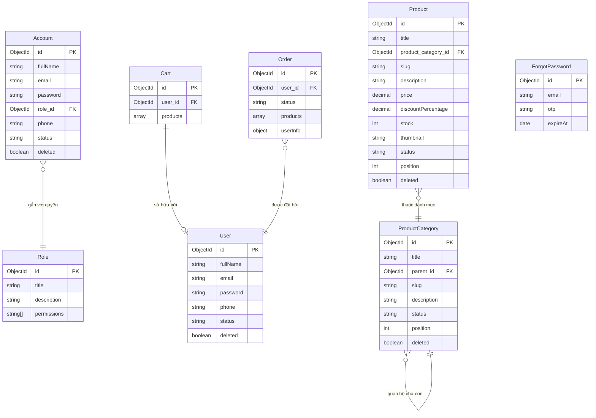

<h1 align="center">
  <a href="https://nitro.build/" target="blank"></a>
  <a href="https://vuejs.org/" target="blank"></a>
  <a href="https://www.typescriptlang.org/" target="blank"></a>
  <a href="https://www.mongodb.com/" target="blank"></a>
  <a href="https://cloudinary.com/" target="blank"></a>
</h1>

<p align="center">Website bán hàng được xây dựng bằng <b>Backend Nitro v3</b> và <b>Frontend Vue 3 SPA (Vite 8)</b> sử dụng TypeScript.</p>

<p align="center">
  
  
  
</p>

## Giới thiệu

Dự án này là một website bán hàng cơ bản, bao gồm giao diện dành cho khách mua hàng (Storefront) và trang quản lý dành cho quản trị viên (Admin Dashboard). Dự án kết nối với cơ sở dữ liệu MongoDB, hỗ trợ lưu trữ ảnh sản phẩm qua Cloudinary và gửi mã OTP xác nhận qua Email.

## Giao diện trang quản trị

https://github.com/user-attachments/assets/df1e0cff-246a-4aed-8f9f-77dbb52c27e1

---

## Giao diện khách hàng

https://github.com/user-attachments/assets/322909ae-482a-4da7-85be-11925ddf3eef

## Mục lục

- [Tính năng](#tính-năng)
- [Công nghệ sử dụng](#công-nghệ-sử-dụng)
- [Hướng dẫn chạy thử](#hướng-dẫn-chạy-thử)
- [Cấu trúc thư mục](#cấu-trúc-thư-mục)
- [Sơ đồ cơ sở dữ liệu](#sơ-đồ-cơ-sở-dữ-liệu)
- [Phân quyền hệ thống](#phân-quyền-hệ-thống)

---

## Tính năng

- [x] **Giao diện Vue 3**: Chuyển trang nhanh, có hỗ trợ giao diện tối (Dark Mode).
- [x] **Gộp giỏ hàng**: Tự động chuyển sản phẩm từ giỏ hàng tạm của khách vãng lai vào tài khoản sau khi đăng nhập.
- [x] **Đặt hàng an toàn**: Kiểm tra số lượng tồn kho trực tiếp trong cơ sở dữ liệu trước khi tạo đơn hàng để tránh lệch kho.
- [x] **Hủy đơn hoàn kho**: Tự động cộng lại số lượng sản phẩm vào kho khi đơn hàng bị hủy.
- [x] **Tải ảnh lên Cloudinary**: Hỗ trợ tải ảnh sản phẩm trực tiếp từ máy tính lên Cloudinary trong trang quản lý.
- [x] **Danh mục sản phẩm nhiều cấp**: Quản lý danh mục theo cấu trúc cha - con. Không cho phép xóa danh mục nếu vẫn còn sản phẩm thuộc danh mục đó.
- [x] **Thùng rác**: Hỗ trợ xóa tạm thời (xóa mềm) sản phẩm và danh mục để có thể khôi phục lại khi cần.
- [x] **Xác thực JWT**: Đăng nhập bằng mã Token JWT, phân quyền truy cập giữa các tài khoản Admin, Editor và Khách hàng.
- [x] **Gửi mã OTP qua email**: Gửi mã OTP xác nhận về email của khách hàng khi yêu cầu lấy lại mật khẩu (mã có hiệu lực trong 3 phút).
- [x] **Khởi tạo dữ liệu mẫu**: Hỗ trợ tạo nhanh các dữ liệu mẫu (tài khoản, sản phẩm, phân quyền) để chạy thử nhanh dự án.

---

## Công nghệ sử dụng

### Backend (Server)

- **Runtime**: Node.js (phiên bản 20 trở lên)
- **Framework**: Nitro v3 & h3
- **Ngôn ngữ**: TypeScript 5.x
- **Thư viện kết nối DB**: Mongoose 8.x
- **Mã hóa mật khẩu**: Bcrypt 5.x
- **Tạo token**: JsonWebToken 9.x
- **Gửi mail**: Nodemailer 6.x

### Frontend (Giao diện)

- **Core**: Vue 3 (Composition API)
- **Công cụ build**: Vite 8.x
- **Quản lý trạng thái**: Pinia 2.x
- **Bộ định tuyến**: Vue Router 4.x
- **Giao diện**: CSS thuần

---

## Hướng dẫn chạy thử

### Yêu cầu hệ thống

- Đã cài đặt Node.js (phiên bản 20 trở lên).
- Đã có tài khoản cơ sở dữ liệu MongoDB (chạy cục bộ hoặc dùng MongoDB Atlas).
- Đã có tài khoản Cloudinary (để lưu ảnh sản phẩm).

### Các bước cài đặt

1. **Tải mã nguồn về máy**

   ```bash
   git clone https://github.com/phamhoangvu2k7/Ecommerce.git
   cd Ecommerce
   ```

2. **Cài đặt các thư viện**

   ```bash
   npm install --legacy-peer-deps
   ```

3. **Cấu hình file môi trường**
   Tạo một file tên là `.env` ở thư mục gốc của dự án và điền các thông tin sau:

   ```env
   PORT=3000

   # Kết nối MongoDB
   MONGO_URL=đường_dẫn_kết_nối_mongodb
   MONGO_NAME=product-management

   # Gửi mail OTP bằng Gmail
   EMAIL_USER=email_gửi_otp@gmail.com
   EMAIL_PASSWORD=mật_khẩu_ứng_dụng_gmail

   # Lưu trữ ảnh Cloudinary
   CLOUD_NAME=tên_tài_khoản_cloudinary
   CLOUD_KEY=mã_key_cloudinary
   CLOUD_SECRET=mã_secret_cloudinary

   # Chuỗi khóa bảo mật
   SESSION_SECRET=chuỗi_kí_tự_bí_mật_bất_kỳ
   JWT_SECRET=chuỗi_kí_tự_bí_mật_bất_kỳ
   ```

4. **Chạy dự án ở chế độ phát triển**
   ```bash
   npm run dev
   ```
   Sau khi khởi chạy thành công, bạn truy cập trang web tại địa chỉ: [http://localhost:5173](http://localhost:5173)

---

## Cấu trúc thư mục

```
server/                     # Thư mục xử lý Backend (Nitro v3)
├── middleware/
│   └── auth.ts             # Kiểm tra đăng nhập và phân quyền truy cập
├── plugins/
│   └── db.ts               # Kết nối database
├── utils/
│   ├── helpers.ts          # Các hàm tiện ích (mã hóa mật khẩu, gửi mail, upload ảnh)
│   ├── models.ts           # Định nghĩa cấu trúc các bảng MongoDB (Mongoose Schemas)
│   ├── services.ts         # Xử lý các logic chính (đặt hàng, giỏ hàng, xóa danh mục)
│   └── validation.ts       # Kiểm tra hợp lệ dữ liệu đầu vào bằng Zod
└── api/                    # Định nghĩa các đường dẫn API
    ├── seed.get.ts         # API tạo dữ liệu mẫu
    ├── admin/              # Nhóm API quản lý (Dashboard, sản phẩm, danh mục...)
    └── client/             # Nhóm API dành cho khách hàng (đặt hàng, giỏ hàng...)

src/                        # Thư mục giao diện Frontend (Vue 3)
├── components/
│   └── CategoryNode.vue    # Giao diện cây danh mục sản phẩm
├── layouts/
│   ├── ClientLayout.vue    # Khung giao diện bán hàng cho khách
│   └── AdminLayout.vue     # Khung giao diện quản lý cho admin
├── stores/
│   ├── auth.ts             # Quản lý trạng thái đăng nhập
│   └── cart.ts             # Quản lý giỏ hàng
├── pages/                  # Các trang của website (Trang chủ, sản phẩm, giỏ hàng, CRUD...)
├── router.ts               # Cấu hình chuyển trang và chặn truy cập không hợp lệ
└── main.ts                 # Điểm khởi chạy ứng dụng Vue 3
```

---

## Sơ đồ cơ sở dữ liệu

Dưới đây là mô hình liên kết dữ liệu giữa các bảng trong hệ thống:



---

## Phân quyền hệ thống

Hệ thống phân quyền truy cập thông qua mã JWT được chia làm 3 nhóm chính:

1. **Admin (Quản trị viên)**: Có toàn quyền quản lý sản phẩm, danh mục, tài khoản, phân quyền và khôi phục dữ liệu trong thùng rác.
2. **Editor (Biên tập viên)**: Có quyền xem báo cáo, thêm mới hoặc chỉnh sửa sản phẩm và danh mục sản phẩm (không có quyền xóa hoặc quản lý tài khoản admin khác).
3. **Khách hàng**: Xem sản phẩm, quản lý giỏ hàng cá nhân, đặt hàng và theo dõi các đơn hàng của bản thân.

---

<p align="center">Hoàn thiện bởi Phạm Hoàng Vũ</p>
