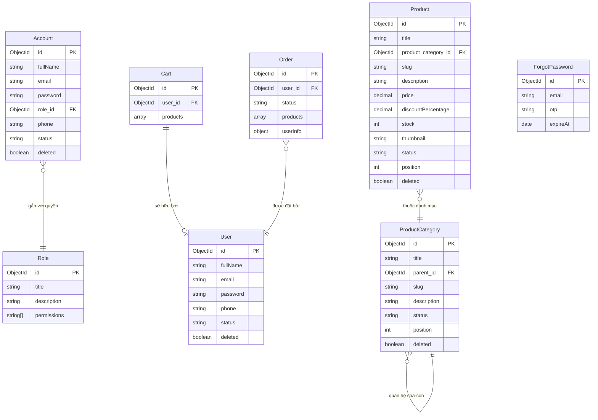

<h1 align="center">
  <a href="https://nitro.build/" target="blank"></a>
  <a href="https://vuejs.org/" target="blank"></a>
  <a href="https://www.typescriptlang.org/" target="blank"></a>
  <a href="https://www.mongodb.com/" target="blank"></a>
  <a href="https://cloudinary.com/" target="blank"></a>
</h1>

<p align="center">Hệ thống website bán hàng hoàn chỉnh tích hợp giữa <b>Backend Nitro v3</b> và <b>Frontend Vue 3 SPA (Vite 8)</b> chuyên nghiệp, mượt mà và trực quan.</p>

<p align="center">
  
  
  
</p>

## Giới thiệu

Một dự án e-commerce hoàn chỉnh từ giao diện khách mua hàng (Storefront) đến trang quản trị (Admin Dashboard). Sử dụng cấu trúc phân tách rõ ràng, các nghiệp vụ đặt hàng an toàn chống lệch kho, tự động gộp giỏ hàng khi đăng nhập, cùng các tính năng lưu trữ hình ảnh trên đám mây Cloudinary và xác thực tài khoản qua Email OTP.

**Link Test API**: [http://localhost:3000/api/seed](http://localhost:3000/api/seed) (Dùng để khởi tạo dữ liệu mẫu khi chạy dưới local)

## Mục lục

- [Tính năng](#tính-năng)
- [Công nghệ sử dụng](#công-nghệ-sử-dụng)
- [Bắt đầu chạy thử](#bắt-đầu-chạy-thử)
- [Cấu trúc thư mục](#cấu-trúc-thư-mục)
- [Sơ đồ Cơ sở Dữ liệu](#sơ-đồ-cơ-sở-dữ-liệu)
- [Phân quyền hệ thống](#phân-quyền-hệ-thống)
- [Đóng gói chạy thực tế](#đóng-gói-chạy-thực-tế)
- [Giấy phép](#giấy-phép)

---

## Tính năng

- [x] **Giao diện Vue 3 mượt mà** - Trải nghiệm chuyển trang nhanh, hiệu ứng premium, thiết kế tối (Dark Mode) thời thượng.
- [x] **Tự động gộp giỏ hàng** - Khi khách đăng nhập, sản phẩm ở giỏ hàng tạm (Guest) tự động gộp vào tài khoản thành viên.
- [x] **Đặt hàng an toàn tuyệt đối** - Kiểm tra kho và trừ sản phẩm trực tiếp ở database. Hỗ trợ tự động hoàn trả hàng vào kho nếu thanh toán gặp lỗi.
- [x] **Hủy đơn hoàn kho** - Khách hàng tự hủy đơn chờ duyệt sẽ tự động cộng trả số lượng sản phẩm lại cửa hàng.
- [x] **Tải ảnh lên Cloudinary** - Nút bấm tải ảnh trực tiếp từ máy tính lên đám mây Cloudinary trong trang quản lý sản phẩm.
- [x] **Quản lý danh mục cha-con** - Cấu trúc thư mục phân cấp nhiều cấp, có khóa bảo vệ tránh xóa danh mục khi vẫn còn sản phẩm đang bán.
- [x] **Thùng rác & Khôi phục** - Xóa mềm sản phẩm/danh mục để phục hồi lại bất cứ lúc nào. Khôi phục sản phẩm tự động khôi phục cả danh mục cha.
- [x] **Bảo mật & Phân quyền** - Đăng nhập tài khoản bằng cơ chế Token JWT tự động, phân quyền truy cập chặt chẽ giữa Admin, Editor và Khách hàng.
- [x] **Mã OTP lấy lại mật khẩu** - Sinh mã OTP ngẫu nhiên gửi về email khách hàng và tự động hủy hiệu lực sau 3 phút.
- [x] **Seed dữ liệu mẫu** - Khởi tạo toàn bộ dữ liệu kiểm thử (tài khoản, sản phẩm, phân quyền) chỉ với một click.

---

## Công nghệ sử dụng

### Backend (Server)
- **Runtime**: Node.js (>=20.0.0)
- **Framework**: Nitro v3 & h3
- **Ngôn ngữ**: TypeScript 5.x
- **Cơ sở dữ liệu**: MongoDB (thông qua Mongoose 8.x)
- **Mã hóa mật khẩu**: Bcrypt 5.x
- **Token bảo mật**: JsonWebToken 9.x
- **Gửi mail**: Nodemailer 6.x

### Frontend (Giao diện)
- **Core**: Vue 3 (Composition API)
- **Build Tool**: Vite 8.x (Tích hợp liền quy trình chạy với Nitro)
- **Quản lý trạng thái**: Pinia 2.x
- **Chuyển trang**: Vue Router 4.x
- **Giao diện**: CSS Vanilla (Hệ màu HSL, hiệu ứng Glassmorphism)

---

## Bắt đầu chạy thử

### Chuẩn bị trước
- Đã cài đặt Node.js (bản 20 trở lên).
- Đã có cơ sở dữ liệu MongoDB (Chạy local trên máy hoặc MongoDB Atlas trên đám mây).
- Tài khoản Cloudinary (để upload ảnh sản phẩm).

### Các bước cài đặt

1. **Tải mã nguồn và truy cập thư mục**
   ```bash
   git clone https://github.com/phamhoangvu2k7/Ecommerce.git
   cd Ecommerce
   ```

2. **Cài đặt thư viện**
   ```bash
   npm install --legacy-peer-deps
   ```

3. **Cấu hình file môi trường**
   Tạo tệp `.env` tại thư mục gốc của dự án:
   ```env
   PORT=3000

   # Kết nối MongoDB
   MONGO_URL=đường_dẫn_kết_nối_mongodb_atlas_hoặc_local
   MONGO_NAME=product-management

   # Gửi mail OTP bằng Gmail
   EMAIL_USER=địa_chỉ_email_gửi_otp@gmail.com
   EMAIL_PASSWORD=mật_khẩu_ứng_dụng_gmail

   # Lưu trữ ảnh Cloudinary
   CLOUD_NAME=tên_tài_khoản_cloudinary
   CLOUD_KEY=mã_key_cloudinary
   CLOUD_SECRET=mã_secret_cloudinary

   # Chuỗi khóa bảo mật chạy JWT
   SESSION_SECRET=chuỗi_kí_tự_bí_mật_bất_kỳ
   JWT_SECRET=chuỗi_kí_tự_bí_mật_bất_kỳ
   ```

4. **Khởi chạy ứng dụng (Chế độ phát triển)**
   ```bash
   npm run dev
   ```
   Sau khi chạy, truy cập giao diện tại: [http://localhost:5173](http://localhost:5173)

5. **Tạo dữ liệu thử nghiệm (Seed Data)**
   Truy cập đường dẫn sau trên trình duyệt để khởi tạo nhanh các tài khoản và sản phẩm mẫu:
   [http://localhost:5173/api/seed](http://localhost:5173/api/seed)

   *Thông tin đăng nhập mẫu sau khi tạo:*
   - **Tài khoản Admin**: `admin@example.com` / Mật khẩu: `admin123`
   - **Tài khoản Biên tập viên (Editor)**: `editor@example.com` / Mật khẩu: `editor123`
   - **Tài khoản Khách hàng**: `customer@example.com` / Mật khẩu: `customer123`

---

## Cấu trúc thư mục

```
server/                     # Thư mục xử lý Backend (Nitro v3)
├── middleware/
│   └── auth.ts             # Middleware xác thực đăng nhập & quyền truy cập (RBAC)
├── plugins/
│   └── db.ts               # Plugin kết nối database & sửa lỗi phân giải DNS SRV
├── utils/
│   ├── helpers.ts          # Các hàm phụ trợ (Mã hóa bcrypt, OTP, Mailer, Cloudinary)
│   ├── models.ts           # Cấu trúc các bảng dữ liệu MongoDB (Mongoose Schemas)
│   ├── services.ts         # Logic xử lý chính (Đặt hàng, giỏ hàng, xóa danh mục)
│   └── validation.ts       # Kiểm tra hợp lệ dữ liệu đầu vào bằng Zod
└── api/                    # Các đầu API tương tác dữ liệu
    ├── seed.get.ts         # API tạo nhanh dữ liệu mẫu
    ├── admin/              # Nhóm API quản lý (Dashboard, CRUD, Trash, Upload)
    └── client/             # Nhóm API bán hàng (Sản phẩm, Cart, Checkout, Profile)

src/                        # Thư mục giao diện Frontend (Vue 3)
├── components/
│   └── CategoryNode.vue    # Hiển thị cây danh mục cha-con đệ quy
├── layouts/
│   ├── ClientLayout.vue    # Khung giao diện bán hàng storefront
│   └── AdminLayout.vue     # Khung giao diện trang quản lý admin
├── stores/
│   ├── auth.ts             # Quản lý đăng nhập tạm thời
│   └── cart.ts             # Quản lý và đồng bộ giỏ hàng
├── pages/                  # Các trang chi tiết (Home, Product, Cart, Admin CRUD,...)
├── router.ts               # Cài đặt chuyển trang & chặn truy cập trái phép
└── main.ts                 # Điểm khởi tạo và chạy ứng dụng Vue 3
```

---

## Sơ đồ Cơ sở Dữ liệu

Dưới đây là mô hình liên kết dữ liệu thực tế giữa các thực thể chính trong hệ thống:



---

## Phân quyền hệ thống

Hệ thống phân quyền truy cập thông qua mã JWT được chia làm 3 nhóm chính:
1. **Admin (Quản trị viên tối cao)**: Sở hữu toàn bộ các quyền quản lý sản phẩm, danh mục, cấu trúc phân cấp, xem thống kê doanh thu và phục hồi dữ liệu trong thùng rác.
2. **Editor (Biên tập viên)**: Chỉ có quyền xem thống kê, tạo/chỉnh sửa sản phẩm và danh mục (không có quyền xóa cứng hoặc quản lý tài khoản).
3. **Customer (Khách mua hàng)**: Chỉ truy cập được trang storefront, quản lý giỏ hàng cá nhân, đặt hàng và xem lịch sử đơn hàng của chính mình.

---

## Đóng gói chạy thực tế

Để tối ưu hiệu năng và đóng gói ứng dụng để chạy thực tế trên máy chủ:

1. **Biên dịch và đóng gói**
   ```bash
   npm run build
   ```
   Lệnh này sẽ tạo ra thư mục `.output/` chứa toàn bộ frontend đã nén và server backend đã đóng gói.

2. **Khởi chạy độc lập**
   ```bash
   node .output/server/index.mjs
   ```
   Hệ thống sẽ chạy ổn định trên cổng bạn cấu hình (mặc định là cổng `3000`).

---

## Giấy phép

Dự án này được cấp phép theo các điều khoản của **MIT License**. Xem file LICENSE để biết thêm chi tiết.

---
<p align="center">Được hoàn thiện với ❤️ bởi Antigravity</p>
