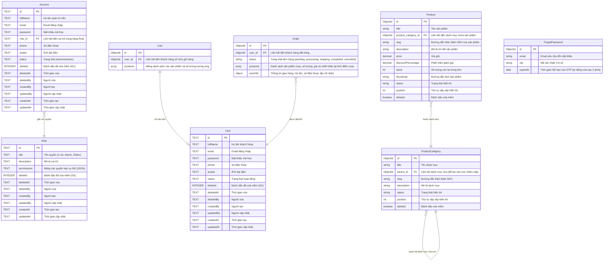

<h1 align="center">
  <a href="https://nuxt.com/" target="blank"></a>
  <a href="https://vuejs.org/" target="blank"></a>
  <a href="https://www.typescriptlang.org/" target="blank"></a>
  <a href="https://www.sqlite.org/" target="blank"></a>
  <a href="https://www.cloudflare.com/" target="blank"></a>
</h1>

<p align="center">Website bán hàng được xây dựng bằng <b>Nuxt 3</b> & <b>Nuxt Hub</b> sử dụng TypeScript.</p>

<p align="center">
  
  
  
</p>

Dự án website bán hàng (E-Commerce) được xây dựng trên nền tảng **Nuxt 3** và **Nuxt Hub** sử dụng ngôn ngữ **TypeScript**. Hệ thống bao gồm giao diện mua sắm dành cho khách hàng và trang quản trị (Admin Dashboard) dành cho người quản lý. Dữ liệu của trang web được lưu trữ thông qua cơ sở dữ liệu **SQLite (Cloudflare D1)**, ảnh sản phẩm được quản lý bằng **Nuxt Hub Blob (Cloudflare R2)**, và hệ thống gửi mã OTP xác nhận tài khoản qua email thông qua **Resend API** (hoặc hiển thị log dưới console khi chạy ở môi trường phát triển).

---

## Giao diện trang quản trị

https://github.com/user-attachments/assets/f1a28b9e-0b26-4eed-9892-c5f229df9023

---

## Giao diện khách hàng

https://github.com/user-attachments/assets/554ebff2-0e78-4b56-b3a6-c5e5e9245e93

---

## Các tính năng của dự án

Dự án tích hợp các tính năng cơ bản và thực tế của một ứng dụng thương mại điện tử:

* **Giao diện Responsive & Dark Mode**: Hỗ trợ hiển thị trên các thiết bị khác nhau (máy tính, máy tính bảng, điện thoại) và chuyển đổi giao diện sáng/tối (Dark Mode).
* **Đồng bộ giỏ hàng**: Cho phép khách vãng lai thêm sản phẩm vào giỏ hàng tạm thời, sau đó tự động gộp vào giỏ hàng của tài khoản cá nhân sau khi đăng nhập thành công.
* **Kiểm tra tồn kho**: Hệ thống kiểm tra số lượng tồn kho thực tế trong database trước khi cho phép tạo đơn hàng để tránh tình trạng lệch kho.
* **Hoàn trả kho**: Tự động cập nhật tăng lại số lượng sản phẩm của kho hàng khi đơn hàng tương ứng bị hủy.
* **Quản lý danh mục đa cấp**: Hỗ trợ tạo danh mục theo cấu trúc cha - con. Không cho phép xóa danh mục nếu danh mục đó hoặc các danh mục con trực thuộc vẫn đang chứa sản phẩm đang bán.
* **Thùng rác (Xóa mềm)**: Hỗ trợ cơ chế xóa mềm cho sản phẩm và danh mục để quản trị viên có thể khôi phục lại hoặc xóa vĩnh viễn khi cần.
* **Bảo mật bằng JWT**: Mật khẩu người dùng được mã hóa bằng `bcrypt-edge`. Xác thực và phân quyền truy cập thông qua mã thông báo JWT.
* **Xác thực OTP qua email**: Gửi mã OTP xác nhận khi người dùng yêu cầu khôi phục mật khẩu (sử dụng dịch vụ Resend API), mã có thời hạn hiệu lực trong vòng 3 phút.

---

## Công nghệ sử dụng trong dự án

### Phía Server (Backend)
* **Framework**: Nuxt 3 Server Routes (hoạt động trên nền Nitro v3 & h3) kết hợp với **Nuxt Hub**.
* **Database & ORM**: **SQLite (Cloudflare D1)** kết hợp với **Drizzle ORM** (thông qua `hub:db`).
* **KV Storage**: **Cloudflare KV** hỗ trợ lưu trữ Key-Value (ví dụ: OTP, Caching).
* **Mã hóa mật khẩu**: `bcrypt-edge` (tương thích hoàn toàn trên môi trường Cloudflare Workers / Edge Runtime).
* **Xác thực**: Token JWT (thư viện `jose`).
* **Gửi Email OTP**: Sử dụng dịch vụ **Resend API** (hoặc hiển thị log dưới console khi chạy ở môi trường phát triển).
* **Kiểm tra dữ liệu đầu vào (Validation)**: Zod 3.x (kiểm tra định dạng email, mật khẩu, dữ liệu gửi lên từ client).

### Phía Giao diện (Frontend)
* **Framework chính**: Nuxt 3 (Vue 3 Composition API).
* **Quản lý trạng thái (State Management)**: Pinia 2.x.
* **Giao diện**: CSS thuần (Vanilla CSS), thiết kế tương thích với các kích thước màn hình (Responsive).

---

## Danh sách các API sử dụng trong dự án

Dưới đây là danh sách các endpoint API được xây dựng trong hệ thống, phân loại theo chức năng:

### 1. API dành cho khách hàng (Client)

| Phương thức | Đường dẫn (Endpoint) | Chức năng |
| :--- | :--- | :--- |
| **Xác thực & Tài khoản** | | |
| `POST` | `/api/client/user/register` | Đăng ký tài khoản khách hàng mới |
| `POST` | `/api/client/user/login` | Đăng nhập tài khoản |
| `POST` | `/api/client/user/logout` | Đăng xuất tài khoản |
| `GET` | `/api/client/user/me` | Lấy thông tin tài khoản hiện tại |
| `POST` | `/api/client/user/forgot-password` | Gửi yêu cầu mã OTP khôi phục mật khẩu |
| `POST` | `/api/client/user/verify-otp` | Xác thực mã OTP |
| `POST` | `/api/client/user/reset-password` | Đặt lại mật khẩu mới |
| `GET` | `/api/client/user/orders` | Lấy danh sách đơn hàng đã mua |
| `POST` | `/api/client/user/orders/:id/cancel` | Hủy đơn hàng |
| **Sản phẩm & Danh mục** | | |
| `GET` | `/api/client/products` | Lấy danh sách sản phẩm (hỗ trợ lọc, tìm kiếm, phân trang) |
| `GET` | `/api/client/products/:id` | Lấy thông tin chi tiết sản phẩm |
| `GET` | `/api/client/categories` | Lấy danh sách danh mục sản phẩm (cấu trúc hình cây) |
| **Giỏ hàng** | | |
| `GET` | `/api/client/cart` | Lấy danh sách sản phẩm trong giỏ hàng hiện tại |
| `POST` | `/api/client/cart/add` | Thêm sản phẩm vào giỏ hàng |
| `POST` | `/api/client/cart/update` | Cập nhật số lượng sản phẩm trong giỏ hàng |
| `POST` | `/api/client/cart/delete` | Xóa sản phẩm khỏi giỏ hàng |
| **Thanh toán & Đặt hàng** | | |
| `POST` | `/api/client/checkout` | Tạo đơn hàng mới |

### 2. API dành cho quản trị viên (Admin)

| Phương thức | Đường dẫn (Endpoint) | Chức năng |
| :--- | :--- | :--- |
| **Xác thực** | | |
| `POST` | `/api/admin/auth/login` | Đăng nhập tài khoản quản trị |
| `POST` | `/api/admin/auth/logout` | Đăng xuất tài khoản quản trị |
| `GET` | `/api/admin/auth/me` | Lấy thông tin tài khoản quản trị hiện tại |
| **Quản lý Tài khoản (Accounts)** | | |
| `GET` | `/api/admin/accounts` | Lấy danh sách các tài khoản quản trị |
| `POST` | `/api/admin/accounts` | Tạo tài khoản quản trị mới |
| `PATCH` | `/api/admin/accounts/:id` | Cập nhật thông tin tài khoản |
| `DELETE` | `/api/admin/accounts/:id` | Xóa tài khoản quản trị (xóa mềm) |
| **Quản lý Danh mục (Categories)** | | |
| `GET` | `/api/admin/categories` | Lấy danh sách các danh mục sản phẩm |
| `POST` | `/api/admin/categories` | Tạo danh mục sản phẩm mới |
| `GET` | `/api/admin/categories/:id` | Lấy chi tiết danh mục |
| `PATCH` | `/api/admin/categories/:id` | Cập nhật thông tin danh mục |
| `DELETE` | `/api/admin/categories/:id` | Xóa danh mục sản phẩm (xóa mềm) |
| **Quản lý Sản phẩm (Products)** | | |
| `GET` | `/api/admin/products` | Lấy danh sách các sản phẩm |
| `POST` | `/api/admin/products` | Thêm sản phẩm mới |
| `GET` | `/api/admin/products/:id` | Lấy thông tin chi tiết sản phẩm |
| `PATCH` | `/api/admin/products/:id` | Cập nhật thông tin sản phẩm |
| `DELETE` | `/api/admin/products/:id` | Xóa sản phẩm (xóa mềm) |
| **Quản lý Vai trò & Quyền (Roles)** | | |
| `GET` | `/api/admin/roles` | Lấy danh sách các vai trò hệ thống |
| `POST` | `/api/admin/roles` | Tạo vai trò mới |
| `PATCH` | `/api/admin/roles/:id` | Cập nhật thông tin và phân quyền vai trò |
| `DELETE` | `/api/admin/roles/:id` | Xóa vai trò |
| **Thùng rác (Trash)** | | |
| `GET` | `/api/admin/trash` | Lấy danh sách sản phẩm và danh mục đã xóa mềm |
| `POST` | `/api/admin/trash/restore` | Khôi phục sản phẩm hoặc danh mục đã xóa mềm |
| **Thống kê & Tiện ích** | | |
| `GET` | `/api/admin/dashboard` | Lấy dữ liệu thống kê tổng quan (Dashboard) |
| `POST` | `/api/admin/upload` | Tải tệp tin/hình ảnh lên (Blob storage) |

### 3. API Khởi tạo dữ liệu (Seeding)

| Phương thức | Đường dẫn (Endpoint) | Chức năng |
| :--- | :--- | :--- |
| `GET` | `/api/seed` | Khởi tạo dữ liệu mẫu cho cơ sở dữ liệu (tài khoản, sản phẩm, danh mục) |

---

## Hướng dẫn cài đặt và chạy thử dự án dưới Local

### Yêu cầu chuẩn bị trước
1. Máy tính của bạn đã cài đặt **Node.js** (Khuyến nghị phiên bản LTS mới nhất từ bản 20 trở lên).
*(Lưu ý: Không cần cài đặt bất kỳ cơ sở dữ liệu nào khác, Nuxt Hub sẽ tự động khởi tạo database SQLite nội bộ ngay trong máy của bạn khi chạy dev).*

### Các bước cài đặt chi tiết

**Bước 1: Tải mã nguồn về máy tính**
Mở terminal hoặc command prompt trên máy của bạn và chạy lệnh sau để clone project:
```bash
git clone https://github.com/phamhoangvu2k7/Ecommerce.git
cd Ecommerce
```

**Bước 2: Cài đặt các thư viện cần thiết**
Chạy lệnh install để tải các thư viện trong file `package.json` về thư mục `node_modules`:
```bash
npm install
```

**Bước 3: Tạo và cấu hình file môi trường `.env`**
Tạo một file mới hoàn toàn có tên là `.env` nằm ở thư mục gốc của dự án (cùng cấp với file `nuxt.config.ts`). Sao chép nội dung dưới đây và điền các thông tin của bạn:

```env
# Khóa bí mật dùng để mã hóa Token JWT
JWT_SECRET=chuoi_ky_tu_bi_mat_ngau_nhien_dung_cho_token_jwt

# API Key của Resend để gửi email OTP (Tùy chọn, nếu không khai báo OTP sẽ in ra terminal)
RESEND_API_KEY=re_xxxxxxxxxxxx

# Email người gửi (Tùy chọn, mặc định: onboarding@resend.dev)
EMAIL_FROM=onboarding@resend.dev
```

**Bước 4: Chạy dự án ở chế độ phát triển (Development)**
Chạy lệnh sau để khởi động dự án ở máy của bạn:
```bash
npm run dev
```
Sau khi chạy lệnh, Nuxt sẽ tiến hành biên dịch code. Khi xuất hiện thông báo chạy thành công, bạn mở trình duyệt web và truy cập địa chỉ: [http://localhost:3000](http://localhost:3000)

**Bước 5: Khởi tạo dữ liệu mẫu (Seed Data)**
Khi mới chạy lần đầu, cơ sở dữ liệu của bạn sẽ trống trơn. Để tạo nhanh dữ liệu chạy thử, bạn hãy mở trình duyệt và truy cập vào đường link sau:
```text
http://localhost:3000/api/seed
```
Đợi khoảng vài giây, trình duyệt hiển thị thông báo tạo thành công. Lúc này database của bạn đã có sẵn các sản phẩm, danh mục và tài khoản quản trị để test tính năng.

---

## Cấu trúc thư mục của dự án

```text
├── server/                 # Thư mục chứa toàn bộ logic Backend
│   ├── api/                # Nơi định nghĩa các API routes của ứng dụng
│   │   ├── admin/          # Các API quản lý (Sản phẩm, danh mục, phân quyền, thùng rác,...)
│   │   ├── client/         # Các API dành cho khách hàng (Đăng nhập, đăng ký, giỏ hàng, đặt hàng,...)
│   │   └── seed.get.ts     # API tự động tạo dữ liệu mẫu cho database
│   ├── middleware/         # Middleware lọc và kiểm tra Token JWT của API Backend
│   ├── plugins/            # Các plugin chạy khi khởi động server (Khởi tạo bảng database SQLite)
│   └── utils/              # Chứa các hàm tiện ích (mã hóa mật khẩu, helper, models / query builder...)
│
├── layouts/                # Chứa các khung giao diện chung (Layout Admin, Layout Default)
├── pages/                  # Chứa toàn bộ các trang giao diện của website (Trang chủ, chi tiết, giỏ hàng, dashboard admin,...)
├── components/             # Các thành phần giao diện nhỏ tái sử dụng nhiều lần (ProductCard, CartItem,...)
├── stores/                 # Nơi quản lý State (Trạng thái đăng nhập, giỏ hàng tạm thời) bằng thư viện Pinia
├── middleware/             # Middleware kiểm tra và chặn quyền chuyển trang ở phía Frontend
├── assets/                 # Nơi lưu trữ các file CSS dùng chung của hệ thống
├── app.vue                 # File root giao diện chính, nơi Nuxt mount toàn bộ layout và các page
├── nuxt.config.ts          # File cấu hình cấu trúc, thư viện và biến đầu trang của dự án Nuxt 3
└── package.json            # Nơi khai báo các thư viện sử dụng và tập lệnh chạy dự án
```

---

## Sơ đồ cấu trúc Cơ sở dữ liệu (Database Schema)

Dưới đây là sơ đồ chi tiết các bảng dữ liệu trong SQLite và mối quan hệ giữa chúng trong hệ thống:



---

## Phân quyền trong hệ thống

Hệ thống phân quyền truy cập thông qua JWT và Middleware ở cả Client lẫn Server:

1. **Khách hàng (Client)**:
   * Có quyền duyệt xem sản phẩm, tìm kiếm, lọc danh mục sản phẩm.
   * Thêm sản phẩm vào giỏ hàng cá nhân, tiến hành điền thông tin đặt hàng.
   * Xem và quản lý thông tin tài khoản cá nhân, xem danh sách lịch sử đơn hàng đã đặt và có quyền gửi yêu cầu hủy đơn hàng.

2. **Editor (Biên tập viên)**:
   * Có quyền đăng nhập vào hệ thống trang quản trị Admin Dashboard.
   * Được quyền xem danh sách sản phẩm, danh mục, đơn hàng của hệ thống.
   * Được quyền thêm sản phẩm mới, cập nhật chỉnh sửa thông tin sản phẩm và danh mục sản phẩm.
   * *Hạn chế*: Không có quyền xóa sản phẩm/danh mục (chỉ admin mới được xóa), không được quản lý các tài khoản quản trị khác và không được thay đổi cấu hình phân quyền hệ thống.

3. **Admin (Quản trị viên)**:
   * Có đầy đủ quyền hạn của Editor.
   * Có quyền xóa sản phẩm, danh mục sản phẩm (đưa vào thùng rác) và dọn sạch thùng rác (xóa vĩnh viễn).
   * Quản lý danh sách tài khoản Admin & Editor khác (Tạo mới, sửa thông tin, khóa tài khoản).
   * Tạo mới các vai trò quản trị (Role) và phân chia chi tiết các quyền hạn tương ứng cho từng vai trò đó.

---

<p align="center">Dự án được hoàn thiện bởi <b>Phạm Hoàng Vũ</b></p>
