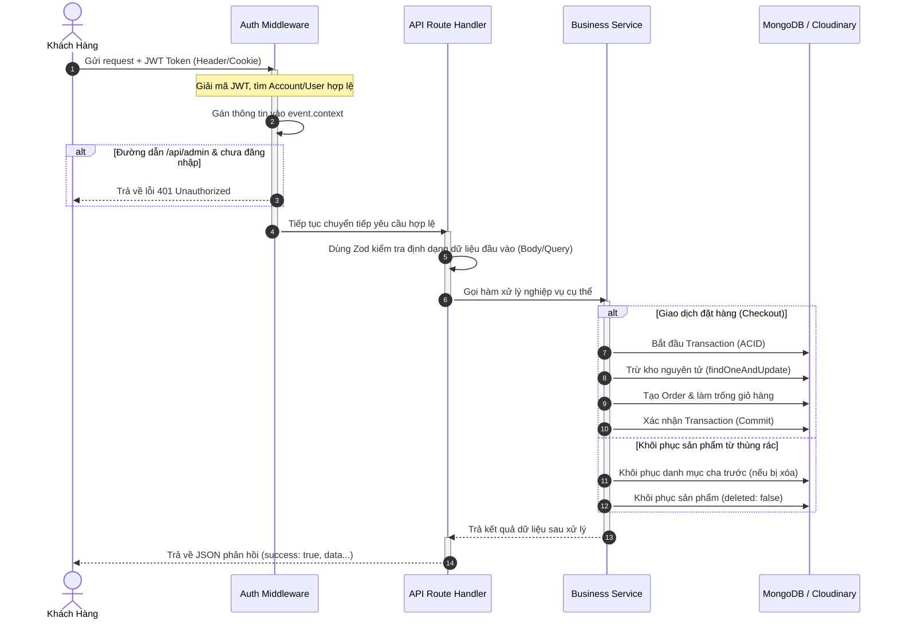

# Hướng Dẫn Chi Tiết Mã Nguồn Backend (Nitro v3)

Tài liệu này cung cấp hướng dẫn chi tiết về cấu trúc, chức năng và cơ chế hoạt động của từng đoạn mã nguồn Backend thuộc thư mục `server/` trong dự án.

---

## 1. Tổng Quan Kiến Trúc Backend

Dự án sử dụng framework **Nitro v3** (chạy trên engine HTTP **h3**). Kiến trúc backend được chia thành các thành phần chính sau:
- **Plugins (`server/plugins/`)**: Chạy một lần khi server khởi động (dùng để cấu hình và thiết lập kết nối cơ sở dữ liệu MongoDB).
- **Middleware (`server/middleware/`)**: Chạy tự động trước mỗi API request để xử lý phân quyền, xác thực và bổ sung thông tin vào context.
- **Utils (`server/utils/`)**: Chứa định nghĩa Model (Mongoose), Schema xác thực (Zod), hàm trợ giúp (helpers) và lớp xử lý nghiệp vụ (services).
- **API routes (`server/api/`)**: Các endpoint thực tế được định cấu hình tự động dựa trên cấu trúc thư mục của Nitro.

---

## 2. Chi Tiết Từng Thành Phần & Đoạn Mã Nguồn

### 2.1. Kết Nối Cơ Sở Dữ Liệu: [server/plugins/db.ts](file:///c:/Users/ASUS/Desktop/projects/nitro-app/server/plugins/db.ts)
File này dùng để thiết lập và quản lý kết nối tới MongoDB thông qua thư viện Mongoose.

#### Đoạn code xử lý phân giải DNS:
```typescript
if (process.env.NODE_ENV !== "production") {
  try {
    dns.setServers(["8.8.8.8", "1.1.1.1"]);
  } catch (e) {
    console.warn("[DNS] Failed to configure custom DNS servers:", e);
  }
}
```
* **Chức năng**: Khi chạy thử nghiệm ở máy local (`NODE_ENV !== "production"`), một số nhà mạng chặn hoặc không phân giải tốt địa chỉ SRV của MongoDB Atlas. Việc ép hệ thống sử dụng DNS công cộng (Google `8.8.8.8` và Cloudflare `1.1.1.1`) giúp kết nối Cloud Database luôn ổn định mà không bị lỗi timeout.

#### Đoạn kết nối Mongoose & Hook tắt server:
```typescript
mongoose.connect(connectionUri, { dbName })
  .then(() => {
    console.log("[MongoDB] Connection established successfully.");
  })
  .catch((err) => {
    console.error("[MongoDB] Connection error:", err);
  });

nitroApp.hooks.hook("close", async () => {
  console.log("[MongoDB] Disconnecting...");
  await mongoose.disconnect();
  console.log("[MongoDB] Disconnected.");
});
```
* **Chức năng**: Khởi chạy kết nối tới MongoDB dựa trên biến môi trường `MONGO_URL` và tên DB `dbName`. Đồng thời, đăng ký sự kiện `close` với Nitro để ngắt kết nối database một cách an toàn khi server tắt (tránh tình trạng rò rỉ kết nối hoặc treo port).

---

### 2.2. Middleware Xác Thực & Phân Quyền: [server/middleware/auth.ts](file:///c:/Users/ASUS/Desktop/projects/nitro-app/server/middleware/auth.ts)
Middleware này tự động can thiệp vào tất cả các yêu cầu HTTP gửi đến server.

#### Bước 1: Trích xuất JWT Token
```typescript
let token = "";
const authHeader = getHeader(event, "authorization");
if (authHeader && authHeader.startsWith("Bearer ")) {
  token = authHeader.substring(7);
}

if (!token) {
  const cookies = parseCookies(event);
  token = cookies.token;
}
```
* **Chức năng**: Lấy Token JWT từ Header `Authorization` (dạng `Bearer <token>`). Nếu client không gửi header, hệ thống sẽ fallback tìm kiếm token lưu tại Cookie trình duyệt (`cookies.token`).

#### Bước 2: Giải mã Token và Gán Context
```typescript
if (token) {
  try {
    const decoded: any = jwt.verify(token, process.env.JWT_SECRET || "a_very_secret_jwt_key_123456");
    if (decoded.role === "admin") {
      const account = await Account.findById(decoded.id).populate("role_id");
      if (account && account.status === "active") {
        event.context.admin = account;
      }
    } else {
      const user = await User.findById(decoded.id);
      if (user && user.status === "active") {
        event.context.user = user;
      }
    }
  } catch (err) {
    console.warn("[AuthMiddleware] JWT Token verification failed.");
  }
}
```
* **Chức năng**: Sử dụng `jsonwebtoken` để verify tính hợp lệ và thời hạn của token.
  * Nếu là tài khoản Admin (`decoded.role === "admin"`): Tìm kiếm trong bảng `Account`, nạp thêm quyền hạn liên kết từ bảng `Role` thông qua `.populate("role_id")`. Lưu tài khoản vào `event.context.admin`.
  * Nếu là Khách hàng (`decoded.role === "client"`): Tìm kiếm trong bảng `User` và lưu vào `event.context.user`.

#### Bước 3: Chặn truy cập trái phép APIs Admin
```typescript
if (path.startsWith("/api/admin") && !path.startsWith("/api/admin/auth/login")) {
  if (!event.context.admin) {
    throw createError({
      statusCode: 401,
      statusMessage: "Bạn cần đăng nhập bằng tài khoản quản trị để truy cập."
    });
  }
}
```
* **Chức năng**: Bảo vệ tất cả các API có tiền tố `/api/admin` (ngoại trừ API đăng nhập `/api/admin/auth/login`). Bất kỳ ai không có thông tin quản trị hoạt động trong `event.context.admin` sẽ bị chặn ngay lập tức và trả về mã lỗi `401 Unauthorized`.

---

### 2.3. Định Nghĩa Dữ Liệu (Mongoose Models): [server/utils/models.ts](file:///c:/Users/ASUS/Desktop/projects/nitro-app/server/utils/models.ts)
Tệp này khai báo các Schema cấu trúc dữ liệu MongoDB.

#### Plugin Xóa Mềm Tự Chế (Soft Delete):
```typescript
export function softDeletePlugin(schema: Schema) {
  schema.add({
    deleted: { type: Boolean, default: false },
    deletedAt: { type: Date, default: null },
    deletedBy: { type: String, ref: "Account", default: null },
    createdBy: { type: String, ref: "Account", default: null },
    updatedBy: { type: String, ref: "Account", default: null }
  });

  const queryMethods = ["find", "findOne", "countDocuments", "estimatedDocumentCount", "findOneAndUpdate", "updateOne", "updateMany"];
  queryMethods.forEach((method) => {
    schema.pre(method as any, function (this: any) {
      const filter = this.getFilter();
      if (filter.deleted === undefined) {
        this.where({ deleted: false });
      }
    });
  });

  schema.pre("aggregate", function (this: any) {
    const pipeline = this.pipeline();
    const hasDeletedFilter = pipeline.some((stage: any) => stage.$match && stage.$match.deleted !== undefined);
    if (!hasDeletedFilter) {
      pipeline.unshift({ $match: { deleted: false } });
    }
  });
}
```
* **Chức năng**: Thay vì xóa vĩnh viễn dữ liệu khỏi DB, plugin này gắn thêm trường `deleted: false`. Khi thực hiện các câu truy vấn Mongoose (`find`, `findOne`, `count`, `aggregate`), Middleware Hook (`schema.pre`) sẽ tự động tiêm thêm điều kiện `{ deleted: false }`. Nhờ đó, lập trình viên không cần viết thủ công điều kiện loại trừ đồ đã xóa trong từng API, tránh lỗi logic hiển thị sản phẩm đã xóa.

#### Các Model Quan Trọng:
1. **`Role`**: Quản lý các nhóm quyền truy cập (mảng `permissions` dạng chuỗi).
2. **`Account`**: Tài khoản nhân viên quản trị (Admin/Editor) liên kết với một `Role`.
3. **`User`**: Tài khoản khách hàng mua sắm.
4. **`ProductCategory`**: Danh mục sản phẩm (sử dụng trường `parent_id` liên kết đệ quy tới chính nó để hỗ trợ danh mục đa cấp).
5. **`Product`**: Thông tin sản phẩm (giá, tồn kho, giảm giá, ảnh đại diện...).
6. **`Cart`**: Giỏ hàng lưu trữ danh sách sản phẩm và số lượng tương ứng của khách hàng hoặc khách vãng lai.
7. **`Order`**: Lưu trữ đơn hàng, bản sao thông tin người nhận tại thời điểm đặt hàng, giá và phần trăm giảm giá lúc mua (tránh bị biến động giá sau này).
8. **`ForgotPassword` (TTL Index)**:
   ```typescript
   ForgotPasswordSchema.index({ expireAt: 1 }, { expireAfterSeconds: 0 });
   ```
   * **Chức năng**: Chứa mã OTP xác thực đổi mật khẩu. Cài đặt chỉ mục TTL (`expireAfterSeconds: 0`) yêu cầu MongoDB tự động quét và xóa sạch bản ghi này ngay khi chạm mốc thời gian `expireAt` (được cấu hình là 3 phút kể từ lúc gửi). Điều này đảm bảo bảo mật và dọn dẹp dung lượng DB tự động.
9. **`AuditLog`**: Ghi nhận nhật ký hoạt động nhạy cảm của các Admin trên hệ thống (ví dụ: Khôi phục dữ liệu, thay đổi phân quyền...).

---

### 2.4. Các Hàm Hỗ Trợ Tiện Ích: [server/utils/helpers.ts](file:///c:/Users/ASUS/Desktop/projects/nitro-app/server/utils/helpers.ts)

#### Cơ chế Mã Hóa & Kiểm Tra Mật Khẩu (Bcrypt):
```typescript
export function hashPassword(password: string): string {
  return bcrypt.hashSync(password, 10);
}
export function comparePassword(password: string, hash: string): boolean {
  return bcrypt.compareSync(password, hash);
}
```
* **Chức năng**: Sử dụng giải thuật muối (Salt rounds = 10) để băm mật khẩu trước khi lưu vào DB. Khi đăng nhập, so sánh mật khẩu dạng thô do người dùng nhập với chuỗi băm an toàn trong DB.

#### Gửi Email OTP & Cơ chế Fallback Tự Động:
```typescript
export async function sendMail(to: string, subject: string, htmlContent: string) {
  // Cấu hình nodemailer...
  // Nếu là tài khoản Gmail thì dùng dịch vụ Gmail.
  // Nếu Gmail lỗi (chưa cấu hình mật khẩu ứng dụng) -> Tự động chuyển hướng sang tài khoản kiểm thử Ethereal:
  const testAccount = await nodemailer.createTestAccount();
  const fallbackTransporter = nodemailer.createTransport({
    host: "smtp.ethereal.email",
    port: 587,
    secure: false,
    auth: { user: testAccount.user, pass: testAccount.pass }
  });
  // ... Gửi thư và in đường dẫn xem trước OTP lên Console log
}
```
* **Chức năng**: Gửi email thông báo mã OTP. Điểm đặc biệt là hàm có khối lệnh `try...catch` thông minh: Nếu tài khoản Gmail cấu hình lỗi hoặc thiếu biến môi trường, nó sẽ tự động tạo một hòm thư ảo tạm thời trên dịch vụ **Ethereal Email**, thực hiện gửi qua đó và xuất mã OTP dạng văn bản trực tiếp ra màn hình Console của máy chủ. Giúp nhà phát triển luôn nhận được OTP để test tính năng mà không bị nghẽn luồng đăng ký/khôi phục mật khẩu.

#### Tải Ảnh Trực Tiếp lên Đám Mây Cloudinary:
```typescript
export async function uploadToCloudinary(fileBuffer: Buffer, folder: string = "products"): Promise<string> {
  return new Promise((resolve, reject) => {
    cloudinary.uploader.upload_stream(
      { folder },
      (error, result) => {
        if (error) return reject(error);
        resolve(result?.secure_url || "");
      }
    ).end(fileBuffer);
  });
}
```
* **Chức năng**: Nhận tệp tin dưới dạng Buffer bộ nhớ, mở một luồng đẩy dữ liệu (`upload_stream`) trực tiếp lên kho lưu trữ ảnh Cloudinary trong thư mục chỉ định. Trả về URL bảo mật (`https`) của bức ảnh sau khi tải lên thành công để lưu vào cơ sở dữ liệu.

#### Sinh Đường Dẫn Thân Thiện (Slugify):
```typescript
export function slugify(str: string): string {
  return str
    .toLowerCase()
    .normalize("NFD")
    .replace(/[\u0300-\u036f]/g, "")
    .replace(/[đĐ]/g, "d")
    .replace(/([^0-9a-z-\s])/g, "")
    .replace(/(\s+)/g, "-")
    .replace(/-+/g, "-")
    .replace(/^-+|-+$/g, "");
}
```
* **Chức năng**: Chuyển đổi tên sản phẩm hoặc danh mục tiếng Việt (ví dụ: *"Điện thoại iPhone 15 Pro Max!"*) thành chuỗi ký tự không dấu ngăn cách bằng dấu gạch ngang chuẩn SEO URL (*"dien-thoai-iphone-15-pro-max"*).

---

### 2.5. Kiểm Tra Dữ Liệu Đầu Vào (Zod): [server/utils/validation.ts](file:///c:/Users/ASUS/Desktop/projects/nitro-app/server/utils/validation.ts)
Sử dụng thư viện **Zod** để định nghĩa bộ lọc dữ liệu chặt chẽ từ phía Client.

* **`ProductValidation`**: Ràng buộc bắt buộc nhập tiêu đề, giá tiền phải `>= 0`, phần trăm giảm giá phải nằm trong khoảng từ `0` đến `100`, số lượng tồn kho phải là số nguyên không âm.
* **`RegisterValidation`**: Ràng buộc đăng ký bắt buộc nhập họ tên, kiểm tra đúng định dạng email, mật khẩu tối thiểu có `6` ký tự.
* **`CheckoutValidation`**: Ràng buộc thanh toán phải điền đầy đủ họ tên, địa chỉ nhận hàng, số điện thoại (từ 9 số trở lên) và ID giỏ hàng hợp lệ.

---

### 2.6. Xử Lý Logic Nghiệp Vụ Chính (Services): [server/utils/services.ts](file:///c:/Users/ASUS/Desktop/projects/nitro-app/server/utils/services.ts)
Đây là trái tim của hệ thống Backend, chứa các thuật toán phức tạp xử lý dữ liệu.

#### 1. Nghiệp Vụ Sản Phẩm & Danh Mục (`ProductService`)
* **Lấy sản phẩm khách hàng (`getProductsClient`)**: Lọc sản phẩm đang bán (`status: "active"`). Lấy đệ quy toàn bộ danh mục con bằng hàm `getChildCategoryIds` để khi khách hàng click vào danh mục cha (ví dụ: *Điện thoại*), hệ thống sẽ tìm kiếm và hiển thị toàn bộ sản phẩm của các danh mục con (ví dụ: *iPhone*, *Samsung*). Nó cũng thực hiện tính toán giá sau khi giảm giá (`priceNew = price * (1 - discountPercentage/100)`) và hỗ trợ lọc khoảng giá trực tiếp dựa trên giá mới tính toán này.
* **Xóa danh mục an toàn (`deleteCategory`)**: 
  ```typescript
  const childCategory = await ProductCategory.findOne({ parent_id: id, deleted: false });
  if (childCategory) throw new Error("...");
  const product = await Product.findOne({ product_category_id: id, deleted: false });
  if (product) throw new Error("...");
  ```
  * **Chức năng**: Chặn hành vi xóa danh mục nếu danh mục đó vẫn chứa danh mục con chưa xóa hoặc vẫn còn sản phẩm đang hoạt động trực thuộc. Đảm bảo tính toàn vẹn dữ liệu, tránh việc sản phẩm bị mồ côi danh mục.
* **Khôi phục liên tầng (Cascading Restore - `restoreProduct` & `restoreCategory`)**:
  ```typescript
  if (product.product_category_id) {
    const category = await ProductCategory.findOne({ _id: product.product_category_id, deleted: true });
    if (category) {
      await this.restoreCategory(category._id.toString());
    }
  }
  ```
  * **Chức năng**: Khi quản trị viên khôi phục một sản phẩm từ Thùng rác, nếu danh mục của sản phẩm đó cũng đang nằm trong Thùng rác, hệ thống sẽ tự động khôi phục danh mục đó lên trước (và đệ quy khôi phục tất cả các danh mục cha cao hơn nữa). Giúp sản phẩm khôi phục lập tức hiển thị đúng danh mục mà không bị lỗi giao diện.

#### 2. Nghiệp Vụ Giỏ Hàng (`CartService`)
* **Thuật toán Gộp Giỏ Hàng (`mergeCarts`)**:
  ```typescript
  for (const guestItem of guestCart.products) {
    const product = await Product.findById(guestItem.product_id);
    if (!product || product.status !== "active") continue;

    const userItemIndex = userCart.products.findIndex(
      (uItem: any) => String(uItem.product_id) === String(guestItem.product_id)
    );

    if (userItemIndex > -1) {
      let mergedQty = userCart.products[userItemIndex].quantity + guestItem.quantity;
      if (mergedQty > product.stock) mergedQty = product.stock; // Khống chế theo tồn kho thực tế
      userCart.products[userItemIndex].quantity = mergedQty;
    } else {
      let qty = guestItem.quantity;
      if (qty > product.stock) qty = product.stock;
      userCart.products.push({ product_id: guestItem.product_id, quantity: qty });
    }
  }
  ```
  * **Chức năng**: Khi người dùng chưa đăng nhập, sản phẩm được lưu ở một giỏ hàng tạm (Guest Cart lưu ID ở Cookie). Khi họ đăng nhập thành công, hệ thống sẽ quét qua từng sản phẩm trong giỏ hàng tạm đó:
    * Nếu sản phẩm chưa có trong giỏ hàng chính thức của tài khoản: Thêm mới và giới hạn số lượng bằng mức tồn kho tối đa.
    * Nếu sản phẩm đã tồn tại: Cộng dồn số lượng từ cả 2 giỏ hàng lại, đồng thời khống chế không cho vượt quá số lượng hàng thực tế còn trong kho. Sau đó dọn sạch giỏ hàng tạm.

#### 3. Nghiệp Vụ Đặt Hàng An Toàn (`CheckoutService`)
* **Thanh Toán Với Mongoose Transactions**:
  ```typescript
  const mongooseSession = await mongoose.startSession();
  try {
    mongooseSession.startTransaction();
    for (const item of cart.products) {
      // Kiểm tra kho
      // Cập nhật trừ kho nguyên tử (Atomic Update) trong Session
      const updatedProduct = await Product.findOneAndUpdate(
        { _id: product._id, stock: { $gte: item.quantity } },
        { $inc: { stock: -item.quantity } },
        { session: mongooseSession, new: true }
      );
      if (!updatedProduct) throw new Error("Sản phẩm đã hết hàng do có người đặt trước.");
    }
    // Tạo bản ghi Order và làm trống Giỏ hàng trong Session...
    await mongooseSession.commitTransaction();
  } catch (error) {
    await mongooseSession.abortTransaction();
  }
  ```
  * **Chức năng**: Đảm bảo quy trình đặt hàng tuân thủ tính chất ACID. Trong cùng một giao dịch (Transaction), hệ thống vừa trừ kho sản phẩm vừa tạo hóa đơn. Nếu có một sản phẩm bất kỳ bị hết hàng giữa chừng hoặc lỗi hệ thống xảy ra, toàn bộ quá trình trừ kho trước đó của các sản phẩm khác sẽ bị hủy bỏ (Rollback), bảo vệ kho hàng không bị lệch hoặc âm kho.
* **Cơ chế Fallback Thủ Công (`processCheckoutFallback`)**:
  * **Chức năng**: Trong trường hợp máy chủ chạy database MongoDB độc lập (Standalone server - không hỗ trợ cấu hình Replica Set để chạy Transaction), hệ thống sẽ kích hoạt luồng Fallback. Luồng này thực hiện trừ kho tuần tự từng sản phẩm bằng lệnh nguyên tử `findOneAndUpdate`. Nếu xảy ra lỗi ở sản phẩm sau, hệ thống sẽ chạy vòng lặp cộng trả lại số lượng (`rollbacks`) đã trừ trước đó cho các sản phẩm đầu tiên một cách thủ công.

---

## 3. Các API Tiêu Biểu

### 3.1. Tạo Dữ Liệu Mẫu: [server/api/seed.get.ts](file:///c:/Users/ASUS/Desktop/projects/nitro-app/server/api/seed.get.ts)
* **Phương thức**: `GET`
* **Quy trình hoạt động**:
  1. Thực hiện xóa sạch (`deleteMany({})`) dữ liệu cũ ở các bảng: `Role`, `Account`, `ProductCategory`, `Product`, `User`.
  2. Tạo 2 nhóm quyền: `Super Admin` (đầy đủ mọi quyền thao tác và thùng rác) và `Editor` (chỉ có quyền xem và sửa sản phẩm/danh mục).
  3. Tạo tài khoản mẫu cho Admin, Editor và Khách hàng (mật khẩu được mã hóa thông qua hàm helper `hashPassword`).
  4. Tạo các danh mục mẫu cấp 1: Điện thoại, Laptop, Phụ kiện.
  5. Tạo các sản phẩm mẫu tương ứng kèm giá, tỷ lệ giảm giá, số lượng tồn kho và link ảnh đại diện mẫu.
  6. Lưu tất cả vào DB và trả về phản hồi thành công.

### 3.2. Quên Mật Khẩu & Gửi OTP: [server/api/client/user/forgot-password.post.ts](file:///c:/Users/ASUS/Desktop/projects/nitro-app/server/api/client/user/forgot-password.post.ts)
* **Phương thức**: `POST`
* **Quy trình hoạt động**:
  1. Nhận `email` từ client, kiểm tra xem email này có tồn tại trong hệ thống khách hàng (`User`) hay không.
  2. Sinh mã OTP ngẫu nhiên gồm 6 chữ số và thiết lập thời gian hết hạn là 3 phút (`Date.now() + 3 * 60 * 1000`).
  3. Xóa các mã OTP cũ của email này trong DB để tránh rác dữ liệu, sau đó lưu bản ghi OTP mới vào bảng `ForgotPassword`.
  4. Tạo nội dung email HTML chứa mã OTP và gửi qua hàm `sendMail`. Trả về trạng thái thông báo khách hàng kiểm tra hòm thư.

### 3.3. Xác Thực OTP: [server/api/client/user/verify-otp.post.ts](file:///c:/Users/ASUS/Desktop/projects/nitro-app/server/api/client/user/verify-otp.post.ts)
* **Phương thức**: `POST`
* **Quy trình hoạt động**:
  1. Đối chiếu `email` và `otp` do người dùng gửi lên với dữ liệu lưu trong bảng `ForgotPassword`.
  2. Nếu không tìm thấy hoặc đã quá 3 phút (MongoDB tự động xóa do chỉ mục TTL), hệ thống báo lỗi OTP không hợp lệ hoặc hết hạn.
  3. Nếu khớp, sinh ra một JWT Token tạm thời chứa thông tin `{ email, role: "reset-password" }` có thời hạn siêu ngắn là 10 phút (`expiresIn: "10m"`).
  4. Xóa ngay bản ghi OTP này khỏi DB để ngăn ngừa tấn công phát lại (Replay Attack - dùng lại mã OTP cũ). Trả về token tạm thời này cho client để họ chuyển sang bước nhập mật khẩu mới.

### 3.4. Đổi Mật Khẩu Mới: [server/api/client/user/reset-password.post.ts](file:///c:/Users/ASUS/Desktop/projects/nitro-app/server/api/client/user/reset-password.post.ts)
* **Phương thức**: `POST`
* **Quy trình hoạt động**:
  1. Kiểm tra tính hợp lệ của token tạm thời `resetToken` được gửi từ bước trước. Xác nhận vai trò lưu trong token phải đúng là `"reset-password"`.
  2. Trích xuất email từ token, tìm kiếm người dùng tương ứng trong DB.
  3. Tiến hành băm mật khẩu mới nhập và cập nhật vào thuộc tính `password` của người dùng đó. Lưu thay đổi và yêu cầu người dùng đăng nhập lại.

### 3.5. Tải Ảnh Lên Cloudinary: [server/api/admin/upload.post.ts](file:///c:/Users/ASUS/Desktop/projects/nitro-app/server/api/admin/upload.post.ts)
* **Phương thức**: `POST`
* **Quy trình hoạt động**:
  1. Kiểm tra thông tin Admin trong `event.context.admin` và xác minh họ có quyền hạn `"products_create"` hoặc `"products_edit"`. Nếu không có, lập tức trả về mã lỗi `403 Forbidden`.
  2. Đọc luồng dữ liệu tải lên dưới dạng Form Data bằng hàm `readMultipartFormData(event)`.
  3. Tìm kiếm file đính kèm có tên trường là `"file"`.
  4. Chuyển đổi Buffer dữ liệu của tệp tin này sang hàm helper `uploadToCloudinary` để tải lên đám mây.
  5. Nhận URL ảnh trả về từ Cloudinary và phản hồi lại cho Client để hiển thị lên khung xem trước hoặc điền vào form lưu sản phẩm.

---

## 4. Tổng Kết Cơ Chế Vận Hành Trực Quan


